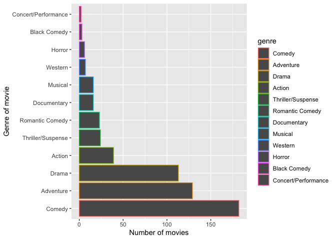

Disney movies, a money question
================
Jeanneret Emilie
2022-11-23

<div align="center">


<div align="left">

# Introduction

Have you ever seen a Disney movie ? I am sure that you cannot respond
“no” to that question. If you really never have seen one, I bet that you
know the worldwide famous mouse (of course I am speaking of Mickey
Mouse).


And this is because [The Walt Disney
Company](https://fr.wikipedia.org/wiki/The_Walt_Disney_Company) is,
since 2012, the first group of entertainment across the world ! Now
talking a little bit about the history of this company, we know that is
has been created in 1923 (100 years next year ! **woaw**). The founders
are Roy and Walter Disney, but the latter is the main character in the
Disney history.

They create many types of movie and you can easily find your way through
it. Indeed, it’s adapted to the whole family. The number of movies they
produced is about *529*, that is huge ! [The
list](https://www.imdb.com/list/ls033609554/) of all movie would take
quite a lot of time to go through but the main element we are interested
in in this research are the income of each movie, and the genre of each
movie.

## Research question

This research is interested in the evolution of incomings of Disney
movies through time. We also want to see is there is an impact of the
genre of movie on the income they engender. Of course, we will need to
adapt the table with inflation rate in order to adapt our data. The main
question here is **Is there an impact of the genre of Disney movies
incomings over time ?**

## Hypothesis

<div align="center">

N0: There is no impact of the genre on the incoming

<div align="center">

N1: There is an impact of the genre on the incoming

<div align="left">

# Data

The data comes from [kaggle](https://www.kaggle.com), where was hidden a
[very interesting
dataset](https://www.kaggle.com/datasets/prateekmaj21/disney-movies)
about disney movies. For this research, we do not need every details and
every lines, even if that would be very interesting to analyze.

As we can see below, the main data table is displaying in the following
way

| movie_title                     | release_month | release_year | genre     | total_gross | inflation_adjusted_gross |
|:--------------------------------|:--------------|-------------:|:----------|------------:|-------------------------:|
| Snow White and the Seven Dwarfs | December      |         1937 | Musical   |   184925485 |               5228953251 |
| Fantasia                        | November      |         1940 | Musical   |    83320000 |               2187090808 |
| Pinocchio                       | February      |         1940 | Adventure |    84300000 |               2188229052 |
| Song of the South               | November      |         1946 | Adventure |    65000000 |               1078510579 |
| Cinderella                      | February      |         1950 | Drama     |    85000000 |                920608730 |

Data table

    ## [1] 579

# Analysis

The first thing we want to look at in this analysis is about the genre.
How many movies from each genre is in our dataset ?

<!-- -->

As we can see in this first barplot is that there are three main genre
of movies that are produced by Disney. Namely **comedy**, **adventure**
and **drama**. Other genre of movies are much less produces as we can
see on the graph. This is an overall view of disney movies production
since they stared.

The following part of this analyze concerns only the revenue of those
movies, over the entire period of movies production from disney
company.This start from the first movie produced, namely *Snow White and
the Seven Dwarfs* in 1937, until the last *The Light Between Oceans* in
2016. Both of those graphs are showing the mean revenue of each year of
movie production. The absent datas were taken off.

<!-- -->

This first graph is about the raw/gross revenu of each movie, since it
came out. In the second graph below, the amount of money generated are
adjusted in term of inflation. This is important because without that
you cannot really compare the first and the last movie, because of the
years gap between them.

<!-- -->

<!-- -->

<!-- -->

The last part of this analysis will consist on a regression analysis. To
see if there’s a correlation between the genre of movie and the revenue
of those genre.

``` r
library(ggplot2)

ggplot(df_clean, aes(total_gross)) +
  geom_histogram(bins = 15) +
  scale_x_continuous(labels = scales::label_number_si()) +
  facet_wrap(vars(genre))
```

<!-- -->

``` r
library(ggplot2)

ggplot(df_clean) +
  aes(x = genre, y = total_gross, color = genre) +
  geom_jitter() +
   scale_y_continuous(labels = scales::label_number_si()) +
  theme(legend.position = "none")
```

<!-- -->

add a section about (<https://statsandr.com/blog/anova-in-r/>) –\> anova
to see if there’s a difference between the mean of groups

``` r
model <- lm(total_gross ~ genre, data = df_clean)
anova(model)
```

    ## Analysis of Variance Table
    ## 
    ## Response: total_gross
    ##            Df     Sum Sq    Mean Sq F value    Pr(>F)    
    ## genre      11 8.0653e+17 7.3321e+16  9.7402 3.303e-16 ***
    ## Residuals 548 4.1251e+18 7.5276e+15                      
    ## ---
    ## Signif. codes:  0 '***' 0.001 '**' 0.01 '*' 0.05 '.' 0.1 ' ' 1

# Conclusion

# References
